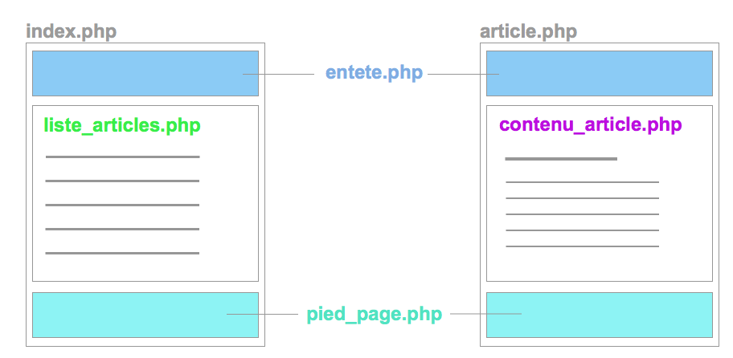

# Semaine 12

## Objectifs
+ Introduction à PHP et MySQL

## J1

### Développement Back-end

+ Rappel : Fonctionnement Internet : Client / Serveur

+ Introduction PHP
  + Personal Home Page » PHP : Hypertext Preprocessor
  + langage serveur interpreté
  + exemple
  + http://phpepl.herokuapp.com

+ [LAMP : Linux Apache Mysql PHP](https://www.digitalocean.com/community/tutorials/how-to-install-linux-apache-mysql-php-lamp-stack-on-ubuntu-14-04)

**Installation**
  + Apache2
  + Mysql
  + PHP5

### PHP

```php

// variables
$nom = "Dupond";
$prenom = 'Jack';
$age = 27;

// fonction
function salut( $nom ){
	echo "Hola ".$nom;
}

salut("Internet");

// tableau
$jours = ["lundi", "mardi", "mercredi", "jeudi","vendredi"];

// tableau associatif ( +-= JS Object )
$notes = [
	"Francais"=> 13,
	"SVT"=> 11,
	"EPS"=>12
];
echo $notes["SVT"];

```

### Exercices

**Accueil / Articles**
Sur une page d'accueil affichez les liens vers trois articles

**Identification Ajax**
créez une page login.html contenant :
- un champ login
- un champ password
- un bouton "login"

Au clic sur le bouton login, via ajax, la page envoie les variables login et password à un fichier login.php

Pour passer les 2 variables login et password au fichier PHP, en mode 'get' :
`login.php?login=toto@gmail.com&password=azerty`

+ si le login/password est correct : login.php renvoie 'ok' » le formulaire est masqué et la page login.html affiche "Bienvenue"

+ sinon login.php renvoie 'error' »  la page login.html affiche "Erreur" au dessus du formulaire

## J2

#### PHP

Correction liste articles / page article



#### Mysql

Base de données relationnelle


```bash
sudo apt-get install mysql-server php5-mysql
sudo mysql_install_db
sudo mysql_secure_installation
mysql -u root -p
```

#### Création / destruction de bases de données et de tables

```sql
SHOW DATABASES;
CREATE DATABASE test;
SHOW DATABASES;
DROP DATABASE test;
SHOW DATABASES;

CREATE DATABASE blog;

USE blog

SHOW TABLES;
CREATE TABLE auteurs( id INT NOT NULL PRIMARY KEY AUTO_INCREMENT,
prenom VARCHAR(30),
nom VARCHAR(30),
mail VARCHAR(40)
);

DESCRIBE auteurs
```

[:memo:Types de colonnes MYSQL court](http://buzut.fr/2012/05/08/les-differents-types-de-colonnes-mysql/)
[:book:Types de colonnes MYSQL détaillé - OC](https://openclassrooms.com/courses/choisir-les-bons-types-de-colonne-sql)

#### Insertion
```sql
INSERT INTO auteurs (`id`, `prenom`, `nom`, `mail`) VALUES (NULL, 'Carl', 'Marques', 'carl.m@gmail.com' );
INSERT INTO auteurs (`id`, `prenom`, `nom`, `mail`) VALUES (NULL, 'Lea', 'Léger', 'leam@gmail.com' );
```

#### Sélection
```sql
SELECT `id`,`prenom`, `nom`, `mail`  FROM auteurs ;
SELECT `id`,`prenom`, `nom`, `mail  FROM auteurs WHERE `prenom`="lea";
```
#### modification
```sql
UPDATE auteurs SET `prenom`="Karl" WHERE `id`=1;
```

#### suppression
```sql
DELETE FROM `auteurs` WHERE id=1;
```

#### Exploration : Créez une/des bases de données, des tables... pays, villes, journal, resultats sportifs

### PHPMyAdmin

```bash
sudo apt-get install phpmyadmin
```

Après installation : <a href="http://localhost/phpmyadmin" target="_blank">ouvrir phpmyadmin</a>

Si dossier non trouvé et qu'aucun *lien* vers phpmyadmin n'existe ds /var/www/html/':

```bash
sudo ln -s /usr/share/phpmyadmin /var/www/html/phpmyadmin

sudo service apache2 restart
```

[Guide d'installation](https://doc.ubuntu-fr.org/phpmyadmin)


#### AJAX / PHP


## J3

**Exercice login ajax - part 2**
En cas d'identification réussie, login.php renvoie des informations au format JSON :
 - le resultat de la requete : 1
 - le nom de l'utilisateur : Pierre Dupont
 - nombre de nouveaux messages : 5

En cas d'erreur seulement
 - resultat de la requete : 0

+ [Correction Login basique](https://github.com/Simplon-lyon/dev-web/tree/master/php/login_basic)
+ [Correction Login Ajax](https://github.com/Simplon-lyon/dev-web/tree/master/php/login_ajax)


#### Bases de PHP
[:memo:Introduction détaillée au PHP :fr:](http://aulas.pierre.free.fr/cou_php_base.html)

[:memo:Introduction détaillée à MYSQL :fr:](http://aulas.pierre.free.fr/cou_sql_syntaxe.html)

#### PHP / MYSQL - Introduction

Il existe plusieurs manières d'accéder à une base de données, mais le principe/process est souvent le même :
+ on crée une connexion à la base de données
+ on décrit une requête
+ on exécute une requête
+ on récupére le résultat
+ on traite le résultat : génération/affichage de HTML ou renvoi de JSON par exemple

+ **[mysqli  - OC](https://openclassrooms.com/courses/maitrisez-mysqli-sans-poo)**

**Sélection**
```php
<?php
if( $connexion = mysqli_connect('localhost', 'root', 'root', 'blog') ){
	$requete = "SELECT * FROM auteurs";

	$reponses  = mysqli_query($connexion, $requete);

	while( $auteur = mysqli_fetch_assoc($reponses) ){
		echo "<div>".$auteur["nom"]."-".$auteur["mail"]."</div>";
	}
	mysqli_free_result($reponses);
} else {
	echo "erreur BDD !";
}
?>
```
**Insertion**

```php
<?php
if( $connexion = mysqli_connect('localhost', 'root', 'root', 'blog') ){
	$requete = "INSERT INTO auteurs(`id`,`prenom`,`nom`,`mail`) VALUES (NULL, 'Li', 'Wang','liwang@gmail.com')";

	$resultat  = mysqli_query($connexion, $requete);

	echo "resultat : ".($resultat ? 'ok':'false');
} else {
	echo "erreur BDD !";
}
?>
```

+ [PDO - OC](https://openclassrooms.com/courses/concevez-votre-site-web-avec-php-et-mysql/lire-des-donnees-2)

```php
<?php
	try
	{
		$connexion = new PDO('mysql:host=localhost; dbname=blog;charset=utf8', 'root', 'root');
	} catch ( Exception $e ){
		die('Erreur : '.$e->getMessage() );
	}

	$requete = "SELECT * FROM auteurs";
	$resultats = $connexion->query($requete);
	while( $auteur = $resultats->fetch() ){
		echo "<div>".$auteur["nom"]."-".$auteur["mail"]."</div>";
	}
	$resultats->closeCursor();
?>
```


### Exercices
+ Imaginez une application de gestion de tâche aka todolist *sauvegardée* en base de données.
  + Quelles informations doivent être enregistrées ? quelle structure de table ?
  + développez l'application

+ Choisissez un blog et essayez d'imaginer sa **structure de données**.

### Défi 1 pour 18/01 : simpllo
+ seul ou à 2 : développer un mini trello avec back-office.
+ publication sur gandi avec Filezilla & sur github

### Défi 2 pour 18/01 : archives
+ site perso avec vos exercices / expérimentations
+ publication sur gandi avec Filezilla & sur github

#### Annexes

+ [Stats Technos Web](http://w3techs.com)
+ [Stats  PHP ](http://w3techs.com/technologies/details/pl-php/5/all)

+ [Gestion des permissions de fichiers](https://doc.ubuntu-fr.org/permissions)

+ [ PHP POO - Grafikart](https://www.youtube.com/watch?v=r_NiFqLvfsc&list=PLjwdMgw5TTLVDKy8ikf5Df5fnMqY-ec16)