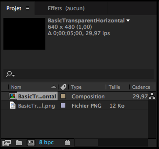
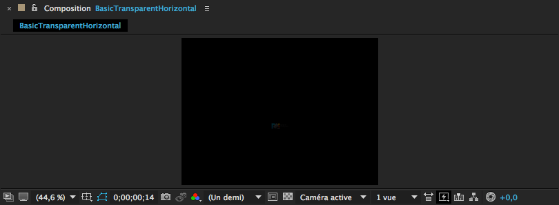
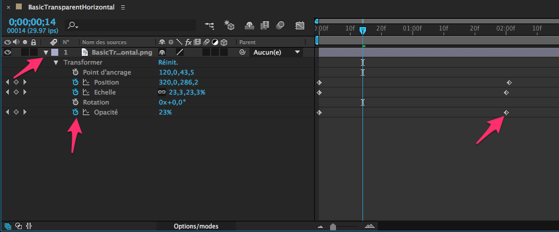

# Semaine 13

## Objectifs :

+ PHP / MySQL
+ Ajax
+ Exploration

## J1

[Questionnaire semaine 12](http://goo.gl/forms/CdwbXiIjHd) » [Résultats](https://docs.google.com/forms/d/1FkL8u16r3sIs8EyaCWbaHMUwdtxyd4Nl1Hi4NcKyr7M/viewanalytics?usp=form_confirm)

## Formulaire PHP

```html
<form action="ajout.php" method="get">
	<input type="text" name="prenom">
	<input type="text" name="nom">
	<input type="text" name="mail">
	<button>Ajouter</button>
</form>
```

Côté PHP, le traitement peut se faire une fois les variables récupérer via $_GET

```php
if( isset($_GET['nom']) && isset($_GET['prenom'])){
	$connexion = mysqli_connect('localhost', 'root','secret') or die('Erreur de connexion BDD');
	$requete = "INSERT INTO auteurs(`id`,`nom`,`prenom`,`mail`) ";
	$resultat = mysqli_query($connexion, $requete) or die ('Erreur de requête BDD');
	echo $requete === true ? 'Le nouvel auteur a bien été ajouté' : 'Oooops :(';
} else {
	echo 'Données invalides';
}
```

Par défaut, les boutons d'un formulaire déclenchent l'ouverture de la page 'action' du formulaire,
c'est sur cette page que le traitement des données saisies dans le formulaire

#### Méthodes : GET ou POST

Jusqu'à présent on a utilisé la méthode 'get' pour l'envoi de données : les paramètres sont passées dans l'url.
C'est la méthode la plus simple pour comprendre l'envoi de données, mais elle a plusieurs limite :
- ce n'est pas très secure
- il y a un nombre limité de caractères  ( 512 caractères par défaut en PHP )

L'autre méthode 'post', n'affiche pas les données dans l'url et n'a pas les mêmes limites de taille.

```html
<form action="ajout.php" method="get">
	<!-- ... -->
</form>
```

Et côté PHP :

```PHP
if( isset($_POST['nom']) && isset($_POST['prenom'])){
	// ...
} else {
	echo 'Données invalides';
}
```

[:book: W3C - POST ou GET ?](http://www.w3.org/2001/tag/doc/whenToUseGet.html#checklist)

#### TechLunch : AfterEffects

**Projet** liste des assets / fichiers / compositions du projet


**Composition** : apercu


**timeline** : définition des variations, ds le temps, de transformation et d'effets



## J2

+ [Correction Login basique](https://github.com/Simplon-lyon/dev-web/tree/master/php/login_basic)
+ [Correction Login Ajax](https://github.com/Simplon-lyon/dev-web/tree/master/php/login_ajax)

+ Suite : connectez le login à une base de données

#### MYSQL

**requêtes préparées**

```php

<?php
$db = new PDO('mysql:host=localhost; dbname=blog;charset=utf8', 'root', 'secret');

// preparation de la requete
$insertion = "INSERT INTO auteurs(`id`,`nom`,`mail`) ";
$insertion .= "VALUES (NULL, :nom, :mail)";
$requete = $db->prepare($insertion);

// remplissage
$requete->bindParam(':nom', $nom, PDO::PARAM_STR);
$requete->bindParam(':mail', $mail, PDO::PARAM_STR);
$result = $requete->execute(); // renvoie TRUE || FALSE

// la requête pourrait être rappelée plusieurs fois avec de nouvelles valeurs

?>
```

#### Finitions sites web d'explorations

## J3

#### PHP/MySQL : Gestion de date

**PHP**

On peut utiliser la fonction date() ou un objet DateTime()

+ [date()](http://us1.php.net/manual/fr/function.date.php)

+ [DateTime](http://php.net/manual/fr/class.datetime.php)

[Memo Format date](docs/PHPDateFormat.pdf)

```php
define( "B", "<br/>" );

$maintenant = new DateTime();
echo $maintenant->format('D d-M-Y').B;

$uneDate = new DateTime('2012/12/31');
echo $uneDate->format('d-M-Y H:i:s').B;

// attention au format US mois/jour/annee
$date = new DateTime('01/12/2012 00:01:03');
echo $date->format('d-m-Y H:i:s').B;
```

+ Timestamp : entier représentant le nb de sec écoulées depuis 1/1/1970

**MYSQL**
Types de colonnes : YEAR, DATE, TIME, DATETIME, TIMESTAMP

```sql
SELECT id, titre FROM articles WHERE publication_date = "2016-04-01";
SELECT id, titre FROM articles WHERE last_update >= "2016-04-01 11:28:32";

UPDATE articles SET last_update = NOW();
```

+ [:memo Dates en SQL - OC ](https://openclassrooms.com/courses/concevez-votre-site-web-avec-php-et-mysql/les-dates-en-sql)
+ [:memo: Liste des fonctions date / heure en MYSQL](http://www.tutorialspoint.com/mysql/mysql-date-time-functions.htm)

**PHP/MYSQL**
+ Stockage en DATETIME
```php
$mysqldate = date( 'Y-m-d H:i:s', $strdate ); // à partir d'une date sous forme de string
// ou
$mysqldate = $datetime1->format('Y-M-d H:i:s'); // à partir d'un objet DateTime

$phpdate = strtotime( $mysqldate ); // renvoie un timestamp
// ou
$maDatetime = new DateTime(strtotime( $mysqldate )); // datetime à partir d'une date mysql
echo '$maDatetime -> '.$maDatetime->format('d-M-Y H:i:s').B;
```


#### TechLunch [Meteor](https://www.meteor.com)
[support](http://www.rxlabz.com/labz/IntroMeteor.key.pdf)

#### [:memo: PHP : Upload de fichiers](https://openclassrooms.com/courses/upload-de-fichiers-par-formulaire)

#### Rédaction d'un "cahier des charges" pour Simpllo || Portfolio

## J5

#### :warning: Envoi du "cahier des charges" pour Simpllo || Portfolio


## Annexes
+ [Interview Nicoptère : Creative Technologist de ouf](http://devmag.fr/nicolas-barradeau-le-dinosaure-des-creative-dev-parisiens/)

[Sources](https://github.com/nicoptere/atelier) des [demos](https://cdn.rawgit.com/nicoptere/atelier/master/index.html) de l'atelier Dataviz donné par Nicoptère à Simplon Montreuil

+ [Validation de formulaire HTML5 - MDN](https://developer.mozilla.org/en-US/docs/Web/Guide/HTML/Forms/Data_form_validation)
+ [Formulaire HTML5 en détail :us:](http://diveintohtml5.info/forms.html?utm_source=twitterfeed&utm_medium=twitter)

#### Conception de base de données
+ [cf. exemples de normalisation](https://fr.wikipedia.org/wiki/Forme_normale_(bases_de_données_relationnelles)#Exemple_de_normalisation)

#### [Raccourcis Vim](assets/vim.jpg)
**Navigation**
+ U annuler
+ 0 début de ligne / $ fin de ligne
+ b début du mot / e fin du mot
+ w mot suivant
+ 1G début de fichier / G fin de fichier

+ H haut de l'écran / M milieu de l'écran / L bas de l'écran

+ :d supprime la ligne
+ C supprimer la ligne et passer en mode Insertion

**Chercher**
+ /chaine recherche la chaine *en avant*
+ ?chaine recherche la chaine *en avant*
+ n prochaine occurence
+ N recherche : occurence précedente

+ * prochaine occurence du mot curseur

**Rechercher remplacer**
+ :%s/recherche/remplacement/flag » recherche remplacer ds toutes les lignes
+ :s/recherche/remplacement/flag » recherche remplacer ds ligne en cours
+ flags : g remplacer tout / c demande de confirmation pour chaq remplacement

**Divers**
+ :x enregistrer et quitter
+ :q! quitter sans enregistrer

+ :r chemin/fichier injecte le contenu d'un autre fichier
