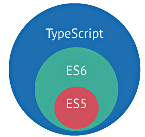

# Semaine 22

## Objectifs
+ Introduction à Typescript
+ Introduction à Sass

## J1

Debug party
- [Donatello PHP](https://github.com/Simplon-lyon/donatello-basic)
  + corriger le bug qui empêche le retour à la liste de projets après l'ajout d'une catégorie (et pour ça : d'abord "debuguer" tout le reste)

## J2

### [TypeScript](http://www.typescriptlang.org)



+ [Visual Studio Code](https://code.visualstudio.com/)
+ [Plugin typescript pour Atom](https://atom.io/packages/atom-typescript)

Javascript typé du futur ( ES6/7+ extras ) » on retrouve l'essentiel des principes de la POO (Java, C#)
- permet un code beaucoup plus "sûr" grâce à des règles strictes vérifiées durant l'édition.
- utilisé pour le développement de Angular2

#### Installation

```bash
$ npm i -g typescript

# compilation
tsc fichier.ts
```

- Option de <a href="https://github.com/Microsoft/TypeScript/wiki/Compiler-Options" target="_blank">compilation/transpilation</a>

##### <a href="http://www.typescriptlang.org/Handbook" target="_blank">Bases</a>

- typage
	- variables, constantes
	- élements de tableau
	- tuples
	- méthodes : paramètres et renvoi
	- <a target="_blank" href="http://definitelytyped.org/docs/flipsnap--flipsnap/interfaces/htmlelement.html">HTMLElement</a>

- classes
  + constructor
  	+ public shortcut
  + accesseurs get set
  + méthodes
  + visibilité : public, private, static
- interfaces
- mixins


#### Exemple : [Lulibul mini jeu](https://github.com/Simplon-lyon/lulibul)

## J3

Suite [Lulibul mini jeu](https://github.com/Simplon-lyon/lulibul)
+ [OpenGameArt](http://opengameart.org)

#### Atelier AFEV

## J4

Typescript & POO : [Lulibul mini jeu v0.3](https://github.com/Simplon-lyon/lulibul)
- classe de chargement des images cf Images
- interface de control du personnage cf HeroController

## J5

> "En attendant c'est pas en lisant des tutos qu'on apprend à faire du vélo !"
> - René, comptoir du Café du coin


#### Défis
- Donatello basic : proposer des pull request de debugs et d'améliorations

- Lulibul : en s'inspirant du code de l'ardoise magique : implémentez l'input#text de commandes dans Lulibul

- React :
	- Composant formulaire de contact
	- Application todo
	- Application "Paint" (canvas avec différents outils de dessin (forme, trait, couleurs...) )

## Annexes

+ [intro VR JS](https://www.youtube.com/watch?v=oroAoCuCc74)

+ Intro <a href="http://angular.io" target="_blank">angular2</a>

+ [Intro modélisation UML](https://openclassrooms.com/courses/apprenez-a-programmer-en-java/modeliser-ses-objets-grace-a-uml)

